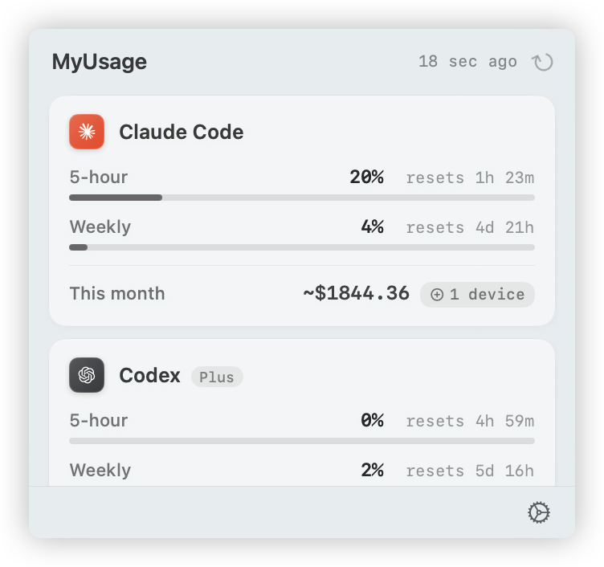

# MyUsage

Native macOS menu bar app for tracking AI coding tool usage across Claude Code, Codex, Cursor, and Antigravity.

Chinese version: [README.zh-CN.md](README.zh-CN.md)



## Highlights

- Unified usage view for multiple AI coding tools in one menu bar popover.
- Optional menu bar tracking for a selected provider.
- Configurable refresh interval (1m / 2m / 5m / 15m / manual).
- Provider ordering, enable/disable toggles, and quick status checks.
- Estimated monthly cost display (Claude Code + Codex).
- Shared sync folder + Devices tab to aggregate costs from multiple Macs.
- Built with system frameworks only (SwiftUI, SQLite3, Security), no third-party dependencies.

## Supported Providers

| Provider | Data Source | What You See |
| --- | --- | --- |
| Claude Code | OAuth API (`~/.claude/.credentials.json` / Keychain) | Current 5h session, 7d window, extra usage |
| Codex | OAuth API (`~/.codex/auth.json` / Keychain) | Current 5h session, 7d window, credits |
| Cursor | Local SQLite + Connect RPC (`state.vscdb`) | Included usage, on-demand spend, billing cycle |
| Antigravity | Local language server process probe | Per-model quota and reset time |

## Requirements

- macOS 14+ (Sonoma)
- At least one supported tool installed and signed in

## Install

Download the latest `MyUsage-<version>.zip` from [GitHub Releases](https://github.com/zchan0/MyUsage/releases), unzip it, then move `MyUsage.app` to `/Applications`.

MyUsage is ad-hoc signed (no paid Apple Developer certificate), so Gatekeeper will warn on first launch:

- Right-click `MyUsage.app` -> `Open` -> `Open` once.
- Or run:

```bash
xattr -cr /Applications/MyUsage.app && open /Applications/MyUsage.app
```

Each release includes a `.sha256` file for checksum verification.

## Quick Usage

1. Launch MyUsage from `/Applications`.
2. Click the menu bar icon to open the usage popover.
3. Use the refresh button for manual sync.
4. Open Settings for:
   - `General`: refresh interval, menu bar tracking, estimated cost toggle, sync folder, launch at login
   - `Providers`: reorder providers and toggle each provider on/off
   - `Devices`: inspect aggregated monthly cost by device and forget stale peers
   - `About`: app version and project link

## Build from Source

```bash
# Release build + app bundle
./Scripts/package_app.sh

# Or build release binary only
swift build -c release

# Open packaged app
open MyUsage.app
```

Open in Xcode (SwiftPM workspace):

```bash
open .swiftpm/xcode/package.xcworkspace
```

## Release Flow

- Update source version/build in `MyUsage/Resources/Info.plist`.
- Prepare release artifacts with:

```bash
./Scripts/prepare_release.sh --version 0.4.0 --build 2
```

This script updates/validates bundle version fields, packages `MyUsage.app`, and outputs:

- `MyUsage-<version>.zip`
- `MyUsage-<version>.zip.sha256`

## Architecture Notes

- `UsageManager` drives refresh orchestration and UI state.
- Provider adapters normalize external/local data into a shared snapshot model.
- Device sync writes each Mac's monthly totals into its own subfolder in the selected sync directory.

More details: [docs/architecture.md](docs/architecture.md)

## Privacy and Data

- MyUsage reads local credential/state files and keychain entries needed by each provider integration.
- Network requests are sent only to provider endpoints required for usage retrieval.
- Multi-device sync uses a user-selected local/shared folder; MyUsage does not run its own cloud backend.

## Roadmap

Possible directions, not commitments. Open an issue if any of these would
make MyUsage materially more useful for you:

- **Token-level usage** — break monthly cost down by model and prompt
  cache hit rate, in addition to the dollar totals already shown.
- **UI redesign** — denser layout, native macOS look refresh.
- **Notarized + signed releases** — so the .app opens without Gatekeeper
  warnings on a fresh Mac.
- **In-app update notifications** — Sparkle or a lightweight "new version
  available" check against GitHub Releases.

## License

MIT
