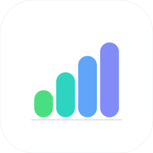
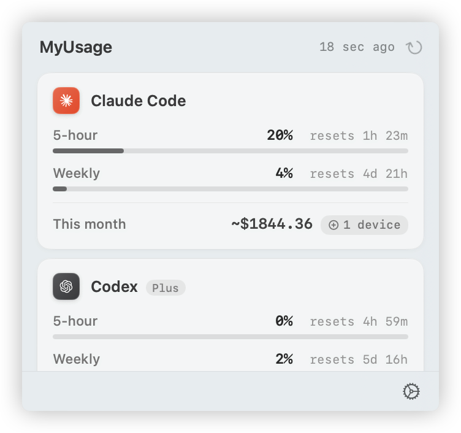
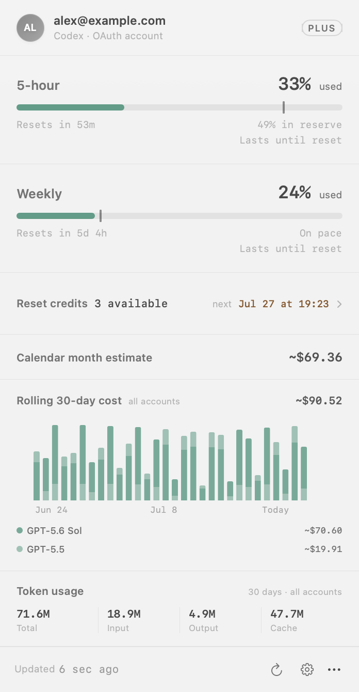

<p align="center">
  
</p>

<h1 align="center">MyUsage</h1>

<p align="center">
  One menu bar for every AI coding tool — across every Mac you use.
</p>

<p align="center">
  <a href="https://github.com/zchan0/MyUsage/releases/latest"></a>
  
  
  <a href="https://zchan0.github.io/MyUsage/"></a>
  <a href="README.zh-CN.md"></a>
</p>

<p align="center">
  <strong>Project site:</strong> <a href="https://zchan0.github.io/MyUsage/">zchan0.github.io/MyUsage</a> — landing, install guide, multi-device sync deep dive, blog.
</p>

<p align="center">
  
  
</p>

## Why MyUsage

If you use **Claude Code, Codex, Cursor, or Antigravity** — and especially if you use them across **more than one Mac** — the official UIs only show what's happening on the device you're sitting at. You hit a weekly limit on Friday afternoon because your laptop has been chewing through tokens all morning while your desktop's "remaining" number lied to you.

MyUsage fixes this with a small native menu bar app that:

- Talks to all four providers and shows them in one popover, so you don't have to flip between four UIs.
- **Aggregates across every Mac you own** by writing tiny snapshots into a folder you already sync (iCloud Drive, Syncthing, Dropbox, an NFS mount — your call). No MyUsage backend exists; the sync transport is yours.
- Tells you whether your current pace leaves capacity in reserve or creates a deficit, then turns that into an actionable outcome: `Runs out in 3h` or `Lasts until reset`.

It's free, MIT, no telemetry, and pure Swift / SwiftUI with zero third-party dependencies.

## Highlights

- **Multi-device aggregation, BYO sync transport.** Each Mac drops a per-device JSONL snapshot into `<sync-folder>/devices/<id>/`. Use iCloud, Syncthing, Dropbox, NAS, or anything else that keeps a folder in sync. The Devices tab in Settings lets you forget retired peers.
- **Four providers in one popover** — Claude Code, Codex, Cursor, Antigravity. Reorder and enable/disable per provider in Settings.
- **Pressure-ordered Overview + clean provider detail.** Overview promotes the limit that needs attention and keeps every provider comparable on one reading axis. Open a provider for account identity, capacity, reset credits, costs, and tokens in a compact clean-glass layout.
- **Actionable pace, in familiar units.** Every rolling limit compares usage with its pace marker as `N% in reserve`, `N% in deficit`, or `On pace`. Once the projection is reliable, MyUsage adds `Runs out in…` or `Lasts until reset`. A conservative early-window fallback catches obvious acceleration without letting one large prompt create a false alarm.
- **30-day model costs with hover inspection.** Claude and Codex get a stacked daily chart plus a stable vertical model-cost breakdown. By default it shows each model's rolling cost; hover a day to see that day's total and per-model costs without the legend changing order.
- **Synced token totals.** Claude and Codex Detail shows 30-day Total / Input / Output / Cache tokens across all ledger accounts and synced Macs, separately from the cost chart.
- **Codex reset-credit inventory.** See the authoritative available count and nearest expiry in one row, then expand it for every reported reset-credit expiry.
- **Per-bucket weekly breakdown for Claude.** Anthropic's `/api/oauth/usage` exposes plan-dependent sub-caps — model families (Opus, Sonnet, Haiku) and product lines (Design, Cowork, OAuth-apps). MyUsage surfaces every non-zero bucket as an indented row under the weekly bar. Plans without separate sub-caps (e.g. Max 5x, where everything pools into the unified weekly total) show none.
- **Limit-pressure notifications.** Native macOS notifications fire the moment any tracked limit crosses your warn / crit threshold (default 80% / 95%, both tunable). Idempotent — same percent across two refreshes never double-fires.
- **In-app update channel.** On launch, MyUsage checks GitHub Releases and shows a banner when a newer tag is available. The Settings → About banner can download the next release and reveal it in Finder one drag away from /Applications.
- **Privacy-respecting device identity.** Multi-device sync uses a salted SHA-256 of `IOPlatformUUID` as the device ID; the raw hardware UUID never leaves the process. Cached in UserDefaults so reinstalling doesn't create a duplicate device.
- **Zero third-party dependencies.** Built only with SwiftUI, SQLite3, Security.framework, Foundation. No Electron, no Sparkle, no analytics SDK.

## Supported Providers

| Provider | Data Source | What You See |
| --- | --- | --- |
| Claude Code | OAuth API (`~/.claude/.credentials.json` / Keychain) + `/api/oauth/profile` for plan label | 5h + weekly limits · reserve/deficit outcome · per-bucket caps · 30-day model cost + token totals · monthly cost |
| Codex | OAuth API (`~/.codex/auth.json` / Keychain) | 5h + weekly limits · reserve/deficit outcome · reset-credit inventory · 30-day model cost + token totals · monthly cost |
| Cursor | Local SQLite + Connect RPC (`state.vscdb`) | Included quota + on-demand budget bars · billing-cycle countdown |
| Antigravity | Local language server process probe | Per-model quota bars · IDE running indicator |

## Requirements

- macOS 14+ (Sonoma)
- At least one supported tool installed and signed in

## Install

Download the latest `MyUsage-<version>.zip` from [GitHub Releases](https://github.com/zchan0/MyUsage/releases), unzip it, then move `MyUsage.app` to `/Applications`.

MyUsage is ad-hoc signed (no paid Apple Developer certificate), so Gatekeeper will warn on first launch:

- Right-click `MyUsage.app` -> `Open` -> `Open` once.
- Or run:

```bash
xattr -cr /Applications/MyUsage.app && open /Applications/MyUsage.app
```

Each release includes a `.sha256` file for checksum verification.

## Quick Usage

1. Launch MyUsage from `/Applications`.
2. Click the menu bar icon for the pressure-ordered Overview, then open a provider for full Detail.
3. Hover a cost-chart day to inspect its total and per-model costs; use the refresh button for manual sync.
4. Open Settings for:
   - `General`: refresh interval, menu bar tracking, estimated cost toggle, sync folder, launch at login
   - `Providers`: reorder providers and toggle each provider on/off
   - `Devices`: inspect aggregated monthly cost by device and forget stale peers
   - `About`: app version and project link

## Build from Source

```bash
# Release build + app bundle
./Scripts/package_app.sh

# Or build release binary only
swift build -c release

# Open packaged app
open MyUsage.app
```

Open in Xcode (SwiftPM workspace):

```bash
open .swiftpm/xcode/package.xcworkspace
```

## Architecture Notes

- `UsageManager` drives refresh orchestration and UI state.
- Provider adapters normalize external/local data into a shared snapshot model.
- Device sync writes each Mac's daily cost/model/token ledger into its own subfolder in the selected sync directory.

More details: [docs/architecture.md](docs/architecture.md)

## Privacy and Data

- MyUsage reads local credential/state files and keychain entries needed by each provider integration.
- Network requests are sent only to provider endpoints required for usage retrieval.
- Multi-device sync uses a user-selected local/shared folder; MyUsage does not run its own cloud backend.

## Roadmap

Possible directions, not commitments. Open an issue if any of these would
make MyUsage materially more useful for you:

- **Notarized + signed releases** — so the .app opens without the Gatekeeper
  warning on a fresh Mac. Blocked on an Apple Developer account.
- **More providers as APIs become available.** GitHub Copilot is the most
  requested but doesn't currently expose per-user usage to individual
  subscribers; we'll add it the moment that changes.
- **iOS / iPadOS companion** for at-a-glance checking when you're not at
  a Mac. Lower priority than core macOS feature work.

## License

MIT
