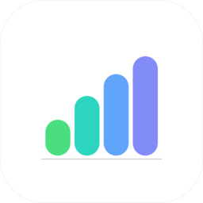

<p align="center">
  
</p>

<h1 align="center">MyUsage（中文说明）</h1>

<p align="center">
  一个菜单栏，统揽你所有 AI 编程工具——并跨所有 Mac 聚合。
</p>

<p align="center">
  <a href="https://github.com/zchan0/MyUsage/releases/latest"></a>
  
  
  <a href="README.md"></a>
</p>

## 为什么需要 MyUsage

如果你用 **Claude Code、Codex、Cursor 或 Antigravity**——尤其是同时用**多台 Mac**——官方 UI 只显示当前这台机器上的状态。结果就是：周五下午突然命中 weekly limit，因为笔记本一上午都在烧 token，桌面机器上显示的"剩余额度"完全是假的。

MyUsage 是一个原生的 macOS 菜单栏小应用，解决方式是：

- 同时对接四个 provider，一个 popover 看完，不用在四个 UI 之间切。
- **跨所有 Mac 聚合**——每台机器把一个 JSONL 快照写到你**已经在同步**的目录里（iCloud Drive、Syncthing、Dropbox、NFS 挂载点都行），完全不依赖 MyUsage 的服务器（也不存在这种东西）。
- 提前告诉你"快烧完了"——每条 limit bar 上叠一层"幽灵延伸"，按当前速度预测你 reset 时会落在哪里。

免费、MIT、不发任何 telemetry，纯 Swift / SwiftUI 实现，零第三方依赖。

## 特色能力

- **跨设备聚合 + 自带同步通道**：每台 Mac 把 per-device 的 JSONL 快照写进 `<sync-folder>/devices/<id>/`。同步通道随你选——iCloud、Syncthing、Dropbox、NAS 都可以。Settings → Devices 可以"忘记"已退役的旧设备。
- **四个 provider 一个弹层**：Claude Code、Codex、Cursor、Antigravity。Settings 里可以拖拽排序、启用/禁用。
- **Burn-rate 预测**：每条 rolling-window bar 上画一层幽灵延伸，告诉你按当前速度 reset 时会到多少。如果会突破 100%，百分数旁边会出现红色 ↗ 箭头。
- **Claude weekly per-model 拆分**：weekly 主条下面 Sonnet / Opus / Haiku 各占一行，按消耗量降序，一眼看到是哪个模型在吃额度。
- **Limit 压力通知**：任意 limit 跨过 warn / crit 阈值（默认 80% / 95%，可调）会立即弹 macOS 系统通知。带幂等：同一档不会重复弹；用量回落后状态自动 reset，下次再升能再触发。
- **应用内升级**：启动时检查 GitHub Releases，发现新版本时菜单栏图标和 Settings → About 都会有提示。banner 上的 Download 按钮可以一键下载新版的 .zip 并在 Finder 里高亮，离"拖到 /Applications"只差一拖。
- **隐私：硬件衍生的设备 ID**：跨设备同步用的设备 ID 是 `IOPlatformUUID` 加盐后 SHA-256 的结果，原始硬件 ID 永远不出本进程。`UserDefaults` 仅作缓存，重装也不会产生重复设备。
- **零第三方依赖**：只用 SwiftUI、SQLite3、Security.framework、Foundation。无 Electron、无 Sparkle、无 analytics SDK。

## 安装

1. 从 [Releases](https://github.com/zchan0/MyUsage/releases) 下载 `MyUsage-<version>.zip`
2. 解压后将 `MyUsage.app` 拖到 `/Applications`
3. 首次启动若出现 Gatekeeper 提示，可右键 `Open` 一次，或执行：

```bash
xattr -cr /Applications/MyUsage.app && open /Applications/MyUsage.app
```

每个 release 都会附带 `.sha256` 文件用于校验包完整性。

## 使用入口

- 点击菜单栏图标查看总览。
- 点刷新按钮手动拉取最新数据。
- 在 Settings 中配置：
  - `General`：刷新频率、菜单栏追踪、预计月费开关、同步目录、开机启动
  - `Providers`：provider 顺序与启用状态
  - `Devices`：查看设备聚合成本、忘记旧设备
  - `About`：版本与项目链接

## 本地构建与打包

```bash
# 打包 .app
./Scripts/package_app.sh

# 或仅构建 release 二进制
swift build -c release
```

## 数据与隐私

- 应用会读取本地凭据/状态文件与 Keychain 中必要信息来拉取各 provider 用量。
- 网络请求仅用于访问对应 provider 的接口。
- 多设备聚合依赖你手动选择的本地/共享同步目录，不依赖 MyUsage 自建云服务。

## 后续方向

不是承诺，只是可能性。如果哪一项对你特别重要，欢迎在 GitHub 开 issue：

- **签名 + 公证打包** — 在新 Mac 上首次打开不再被 Gatekeeper 拦截。卡在没买 Apple Developer 账号上。
- **接入更多 provider**——GitHub Copilot 是被问得最多的，但它目前对个人订阅用户**不开放**用量 API；一旦开放就加。
- **iOS / iPadOS 配套 app** — 不在 Mac 旁也能瞥一眼。优先级低于核心 macOS feature。
