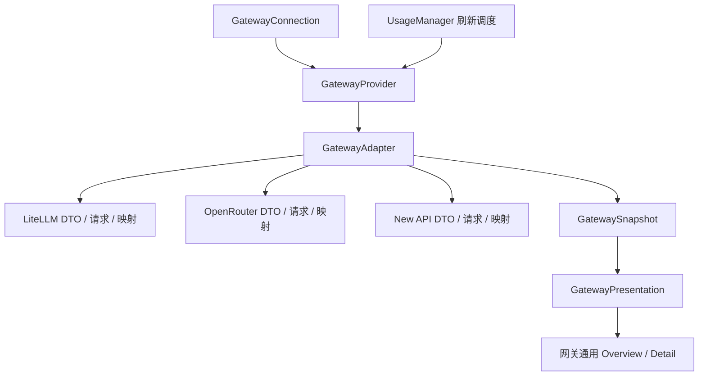

# 网关 Provider 设计提案

状态：LiteLLM 首版已进入实现，2026-09-22；工作区代码未提交、未发布。确定性测试和原生 fixture 检查不代表真实 LiteLLM 部署验收。

### 当前实现边界

- 设置中可新增、改名、编辑、删除多个 LiteLLM 实例；与四个内建 provider 同级，独立排序、启停和菜单栏选择。
- `GatewayAdapter` 定义检查、概要、历史三个操作；`LiteLLMAdapter` 负责实际端点、身份确认和数据映射。概况与历史分别用 `GatewayBlock` 保存成功时间、数据和错误。
- 首版数据结构是一个 user/key 预算概要，加用户级日用量、原始模型别名、费用、token 和请求数。本文的 balance、多重限制、其他单位和 team/account 类型是扩展设计，不是本次已实现能力；没有增加空泛的 capability 矩阵或统一 `ProviderSummary` 类型。
- 历史查询 UTC **本月 1 日至今天**；按页读取，最多 10 页、20 秒。缺少模型分解时另标记不完整。历史只存在内存中，TTL 5 分钟；不写磁盘统计缓存、不进入设备账本、不跨实例求和。
- 网络只读；不跟随重定向；仅 localhost 允许 HTTP。单 host 最多两个在途请求；概要 4 秒、检查历史探测 3 秒。遵守 Retry-After，取消和配置修订号共同防止旧凭据结果写回。
- 原生视图使用当前字号/间距、额度条和页脚；330pt popover 的主体超过屏幕上限时滚动，导航和页脚固定；Overview 固定、provider 横向滚动，实际溢出时提供全部 provider 菜单。LiteLLM 图标基于官方高速列车标志绘制简化单色 SVG；菜单栏使用 18pt template，面板复用当前品牌圆角底板。
- 暂存的未验证连接会在刷新时重新发现 scope；自动发现的 scope 在本次运行中生效，下次启动重新检查，编辑保存时持久化。

主要实现及验收记录见 [gateway-provider-validation.md](gateway-provider-validation.md)。

视觉约束（用户已确认）：网关沿用 MyUsage 当前原生界面的字体、字号、颜色层级、间距、材质、额度条、图表及页脚样式。HTML 草图用于讨论信息结构和数据状态，不是替代现有 SwiftUI 组件的视觉规范；实现以当前组件及原生预览为准。

## 1. 产品模型

用户在 Settings → Providers → 添加网关中选择供应商，配置名称、服务地址和 API key，创建一个独立 provider。同一供应商可以创建多个实例，例如「公司网关 · LiteLLM」和「实验环境 · LiteLLM」。

**层级约束（用户已确认）**：网关是新增自定义 provider 的一种来源，不是一个可切换供应商的共享 provider。创建后的「公司网关」「实验环境」在设置、Overview、详情导航和菜单栏中均与 Claude Code、Codex 同级。Overview 没有 LiteLLM / OpenRouter / New API 供应商选择器，也不负责创建或切换连接配置。

三个概念分开：

| 概念 | 职责 | 例子 |
| --- | --- | --- |
| GatewayVendor | API 适配、供应商名称、图标、地址默认值 | LiteLLM / OpenRouter / New API |
| GatewayConnection | 用户保存的一条连接配置 | 公司网关、个人购买渠道 |
| GatewayProvider | 一条连接的运行态：刷新、数据、错误 | 公司网关当前额度与用量 |

provider 名称优先使用用户起的名称；次级文字显示供应商及 host。图标代表供应商，不代表当前使用的模型。两个 LiteLLM 实例使用相同品牌图标，以名称区分。品牌资源按供应商扩展；本次原生 LiteLLM 使用高速列车单色图标，草图图标仍为占位符。

首版供应商只提供 LiteLLM（用户已确认）。Vendor 暂以只读 `LiteLLM` 显示，不做只有一个选项的下拉框，也不列 OpenRouter / New API 的禁用项或 Coming later 占位。后两者仅保留为架构调研对象，实际接入时再加入供应商选择器。

## 2. 创建和管理流程

保留现有 Settings 的 General / Providers / Devices / About 四个页签。在 Providers 页原有列表下增加 `Add Gateway…` 按钮，点击打开创建 sheet；不新增与 Providers 平行的「Gateways」设置页，也不将所有网关折叠成一个可启停的父 provider。

统一列表的示例：

| 同级条目 | 次级说明 | 管理动作 |
| --- | --- | --- |
| Claude Code | Detected | 排序、启停 |
| Codex | Detected | 排序、启停 |
| 公司网关 | LiteLLM · ai.example.com | 排序、启停、编辑 |
| 实验环境 | LiteLLM · lab.example.com | 排序、启停、编辑 |

列表继续复用当前 `SettingsCard`、24pt 品牌图标、12.5pt 名称、10.5pt 次级文案、上下排序按钮与开关。网关额外显示编辑入口；移除操作放在编辑 sheet 内，避免每行堆叠删除按钮。供应商和连接状态是行的描述信息，不构成第二级导航。

创建 sheet：

1. 供应商固定显示 LiteLLM；填写自己的网关 base URL，允许部署子路径。
2. 填写名称、服务地址、API key。供应商确有额外配置时，由供应商配置区提供，例如可选 user ID；首版不做任意字段表单引擎。
3. 点击 `Check Usage Access`（检查用量读取权限），检查填写的 LiteLLM 网关地址与 API key 能否读取额度/用量。只调用该网关的只读查询接口，不调用模型推理接口。结果用产品语言列出：额度可用、模型明细无权限等；连通 HTTP 或列出模型不能单独视为用量检查成功。
4. `Usage Scope` 是数据统计主体，不是供应商、模型或时间范围。账户统计包含该用户关联的多把 key；当前 key 统计只包含这把 key。表单改用 `Usage for`：检查前隐藏；检查后只有发现两个可用主体时，才显示「My account / This API key」及简短说明。只有一个主体时显示只读结果，不要求用户选择。LiteLLM 优先推荐个人范围；只有 key 信息时明确提示将展示 key 范围。团队限制只作为标有团队名称的独立额度展示。
5. 点击「添加」。已有至少一块可信数据就允许添加；当前网络不可达时可选择「保存，稍后连接」。没有可用数据的项显示未连接，不显示 0%。

连接检查的 API 顺序、权限判定和部分成功处理属于供应商 adapter；协议约定及 LiteLLM 首版请求见第 3.1 节。草图中的按钮仅演示这些状态，没有向网关发送任何请求。

保存后在同一 Providers 列表中独立排序、启用、重命名、编辑和删除。「删除连接」只移除本地配置、凭据和对应缓存，不删除服务端 key。更改 host 或 key 时取消旧请求，并用配置版本号拒绝旧响应写回。换到新 host 时要求重新输入 key，避免自动转发旧凭据。

供应商在创建时确定；编辑现有实例时显示为只读身份，不用切换供应商来复用同一个实例。用途通过用户自定义名称表达，不预设「公司 / 个人 / 购买」三个槽位。同一供应商、相同用途仍可创建多条不同连接，每条获得独立 ProviderID；重复统计范围可提示，但不能按供应商去重。

host 在存储前规范化 scheme、host 和尾斜杠，但保留部署路径。推理 API 的 `/v1` 与管理 API 的根路径由 adapter 明确处理，不做跨供应商的字符串截断。Key 仅发送到配置的目标地址；不跨 origin 转发认证头，不关闭 TLS 校验。默认 HTTPS，明确配置的本地开发 HTTP 单独处理。

## 3. 薄层边界



采用编译期 Swift adapter 注册表；没有运行时脚本、插件系统或 JSONPath 映射引擎。

| 层 | 负责 | 不负责 |
| --- | --- | --- |
| VendorDescriptor | 品牌资源、默认地址、adapter 工厂、配置入口 | 判断某个实际 key 当前有权限 |
| GatewayAdapter | 连接检查的 API 编排与判定、请求路径、认证方式、DTO、分页、单位与语义映射、范围发现 | SwiftUI、定时器、Keychain、保存配置 |
| GatewayProvider | 一个实例的刷新与缓存、并发去重、取消、错误和部分成功合并 | 理解供应商 JSON 字段 |
| GatewaySnapshot | 有明确语义的额度、消费、token、模型明细 | 原始响应、视图布局 |
| GatewayPresentation | 从有效数据产生主指标、区块可见性和可读状态 | 网络请求、供应商字段判断 |
| 通用 View | 渲染预算、余额、消费、token、模型行 | `if vendor == .litellm` 等数据分支 |

建议接口形状（概念签名，不是已实现代码）：

```swift
protocol GatewayAdapter: Sendable {
    var descriptor: GatewayVendorDescriptor { get }
    func checkConnection(_ context: GatewayRequestContext) async throws -> GatewayConnectionCheck
    func fetchSummary(_ context: GatewayRequestContext) async -> GatewaySummaryResult
    func fetchHistory(_ context: GatewayRequestContext,
                      query: GatewayHistoryQuery) async -> GatewayHistoryResult
}
```

`context` 由运行层注入 transport、凭据和配置；adapter 不自行读取文件或系统 Keychain。数据端点的暂时失败返回对应区块的错误，不通过一次 throw 丢掉全部成功结果。鉴权整体失败单独处理。

模型映射只是适配工作的一部分。以后增加供应商通常新增一个 adapter、响应 DTO、映射 fixture、品牌描述和必要配置字段；需处理认证、分页、时间和计费口径。若供应商数据能用已有语义表达，无需修改通用 UI。

### 3.1 连接检查协议

**确认的边界**：UI 调用统一的 `checkConnection`，不知道 URL、DTO、接口顺序和供应商专有的错误码。供应商 adapter 决定调用哪些 API、如何确认身份与读取权限；不会在设置 View 或通用服务中维护 `switch vendor` 的端点表。一次检查允许包含多个只读请求，不简化为一个 `healthURL` 或 HTTP 200 布尔值。

检查支持尚未保存的表单配置。一个轻量协调器负责选择已注册 adapter、传入 draft 的 host/key、短时限与取消；不先创建持久 provider、不先保存 key。成功后用户点击添加，才由配置层保存连接和 Keychain 凭据。现有 `UsageProvider.refresh()` 不承担创建前检查，也不要求 Claude/Codex 等内建 provider 实现网关检查。

返回形状（概念定义，复用概要抓取的结果模型）：

```swift
struct GatewayConnectionCheck: Sendable {
    let checkedAt: Date
    let scopes: [GatewayScopeCheck]
    let issues: [GatewayCheckIssue]
}

struct GatewayScopeCheck: Sendable {
    let scope: GatewayScope
    let summary: GatewaySummaryResult
    let history: GatewayHistoryCheck
}
```

- `summary` 带已确认主体的额度/消费结果及各块状态，与 `fetchSummary` 复用请求、DTO 和映射；不是再做一套检查专用解析。可信概要可在保存后作为同一配置的首次快照，避免立即重复请求。
- `history` 是短查询的检查结果，区分可读、确认无记录、无权限、已知不支持、暂时失败和未检查；只声明响应中能确认的费用、token、模型字段。查询成功但没有记录，不等于已验证所有明细字段，也不等于本月用量为零。
- `issues` 用稳定错误分类和脱敏上下文表达配置无效、身份未确认、认证被拒、接口无权限、响应不兼容、网络/限流等原因；由通用展示层转成文案。连接级错误和某个 scope/block 的错误分别保留；不把原始响应、认证头或 key 回传 UI。
- 普通网络、HTTP、解析错误进入返回结果；`throws` 保留给取消，取消不显示为检查失败。鉴权整体失效时终止依赖请求，不能用旧缓存宣称检查通过。
- 整体状态由当前选中范围的结果推导：有可信额度或消费即「可用」，同时有可选块失败即「部分可用」；只确认身份/HTTP 连通、没有用量数据，仍是「未验证用量」。草稿保存与「验证通过后添加」是不同动作。

**LiteLLM 首版检查顺序**（全部发往用户配置的网关，使用 `Authorization: Bearer <API key>`）：

| 阶段 | API | 检查内容与继续条件 |
| --- | --- | --- |
| 1. 当前 key 与身份 | `GET /key/info`，不带 raw key 查询参数 | 当前 key 的概要及关联 `user_id`；成功时保留可读的 key 额度/消费。不能把返回的允许模型列表当作模型使用记录。 |
| 2. 用户概要 | `GET /user/info?user_id=<已确认的 ID>` | 对齐返回用户 ID，读取用户预算和消费；有可读用户概要时推荐账户范围。该步 403/暂时失败不丢弃第 1 步的 key 结果。 |
| 3. 可选历史探测 | `GET /user/daily/activity?user_id=<已确认的 ID>&start_date=<昨日 UTC 日期>&end_date=<今日 UTC 日期>&page=1&page_size=1` | 验证用户的历史/模型/token 数据能否读取；仅查短区间的第一页，不在 Check Connection 中拉完整月历史。此步失败不使已可用的概要失败。 |

没有确认用户 ID 时不发无范围的用户/历史查询。当前 LiteLLM 源码中，`/user/info` 省略 `user_id` 时会根据普通用户和管理员角色走不同路径，不能统一假设都是个人信息。如果 `/key/info` 在目标部署不可读，可使用配置中显式指定的用户 ID 独立检查 `/user/info`；没有明确主体时返回「无法确认用户范围」，不猜测身份或探测全局报表。需要输入额外用户 ID 时才显示该字段。

当前 key 范围先支持 `/key/info` 能确认的概要；用户级历史不能作为 key 级明细。只有后续针对具体版本实现并验证了 key 过滤，才能启用对应 key 的历史块。团队预算也不能混入个人/key 概要。

两个概要接口共享的辅助请求和解码函数供 `checkConnection` 与定时刷新复用；检查流程不通过再调用一遍完整 `refresh()` 实现。超时有总时限、历史探测有独立短时限；历史超时标为暂时失败，未发起则标为未检查。429 保留 Retry-After，不循环重试。改变 vendor、host、key 或统计范围会取消检查并使结果失效；协调器按配置修订号拒绝旧结果，改名称无需重查。

200 返回 HTML 登录页、错误包装或不能映射为可信用量的 JSON，都不算检查成功。401 与 403 结合端点错误语义解释；403 不等于 key 无效，404 不自动等于供应商不支持。检查不用 `/health`、`/models` 或模型推理来替代用量读取，也不调用创建/修改 key 等写接口。

依据为 LiteLLM [Key 接口源码](https://github.com/BerriAI/litellm/blob/main/litellm/proxy/management_endpoints/key_management_endpoints.py)、[User 接口源码](https://github.com/BerriAI/litellm/blob/main/litellm/proxy/management_endpoints/internal_user_endpoints.py)及[日用量文档](https://docs.litellm.ai/docs/proxy/cost_tracking#daily-spend-breakdown-api)（2026-09-22 核对）。目标部署版本和真实 key 权限尚未验收。以后新增供应商只在其 adapter 实现本协议与请求映射；当前仅注册 LiteLLM。

## 4. 数据模型：统一语义，保留差异

不要把网关字段塞进现有 `sessionUsage` / `weeklyUsage` / `monthlyEstimatedCost`。新增独立 `GatewaySnapshot`：

| 区块 | 数据 | 关键约束 |
| --- | --- | --- |
| Identity | 连接名称、供应商、用户/key 标识、选中范围 | 不存 raw key；只展示需要的身份文字 |
| Quotas | 多个 Budget / Balance / TokenLimit / RequestLimit | 预算与余额分别建模；货币、积分、token 不混用 |
| Totals | cost、tokens、requests，分别可缺省 | 只有费用也能展示；不从价格反推 token |
| History | 日汇总，日期粒度可识别 | 带完整性和时间边界，不用余额差值伪造消费 |
| ModelUsage | 模型 ID、名称、cost/tokens/requests | 数值独立可缺省，保留返回的模型别名 |

每个区块携带 `scope`、`period`、`asOf`、`coverage`、`provenance`，而不只在整个快照上放一份：

- **scope**：user / key / team / account，并保存对应 opaque ID。主体消费和模型分解必须属于同一范围；团队预算不能混作个人预算。
- **period**：有边界的时间范围、当前预算周期、累计值或即时余额；有可用时区和重置时间才展示。`budget_reset_at` 是预算重置时间，不自动等于消费统计结束时间。
- **coverage**：完整、截至某时、部分区间、被条数截断、未知。分页未完成不能显示成完整月累计。
- **provenance**：网关上报 / 本地推算；网关计费值不使用 MyUsage 公共价目表重新定价。

金额用 `Decimal`，明确 ISO currency 或供应商 credit/quota unit；不硬编码 `$`。若 New API 部署的额度换算不明确，就保留原始单位，不能擅自套一个兑换倍率。不同币种不合并。

上限采用 `finite(value)` / `unbounded` / `unspecified`，区分已知不设限和未返回上限。有限上限为零时显式显示无可用额度，不做除零。剩余值优先使用服务端明确提供的 remaining；只在同一 scope、period、unit 下才能从 limit 和 used 推导。

TokenCounts 的 total、input、output、cacheRead、cacheWrite、reasoning 分别可缺省，保留 adapter 确认的包含关系。缓存或 reasoning 可能是 input/output 的子集；不盲目相加。缺字段不是 0；总数来源不清楚时只显示可确认的子项。

模型使用原始 ID 作为稳定身份，展示名可简化。未识别的模型仍按原名展示。第一版不合并不同别名、不推测上游实际模型；模型分组是后续可选展示处理，不是映射必需品。

## 5. 能力和错误状态

供应商声明「可能支持的能力」，连接检查返回「当前连接可用的能力」。以区块状态作为 UI 的实际依据，不维护另一套容易失配的 `supportsCost` / `supportsTokens` 布尔矩阵。

概念状态：`available(data)`、`empty(confirmedPeriod)`、`unsupported`、`forbidden(reason)`、`loading(previous)`、`failed(previous, error)`。旧数据带独立成功时间。403 / 404 不一概判成不支持，adapter 根据供应商与端点语义归类；超时、429、5xx 是可恢复错误。

- 从不支持的区块不占空白区域；设置详情可查看该连接的数据能力。
- 查询确认没有消费：显示「这段时间暂无用量」。
- 供应商提供功能、当前 key 无权访问：显示一个简短提示行。
- 刷新失败：保留对应旧数据并显示更新时间，不能继续把它视为实时数据。
- 部分成功：额度可以更新，模型明细可以保持旧值，各自标记。
- 初次未查询：不能提前显示 0、健康或额度充足。

概要与历史分开刷新。沿用全局刷新调度，后台优先更新额度/消费概要；详情页按需加载历史并做短时缓存。首版缓存 TTL 建议概要随当前刷新周期、历史 5 分钟；手动刷新更新正在看的数据。遵守 Retry-After，按 host 限制并发，同一个实例/查询合并重复请求。凭据或范围变化后使缓存失效。

## 6. UI 方案

保持当前 `PopoverLayout.width = 330pt`，网关详情采用固定阅读顺序，内容按有效数据出现。源码中的部分注释与旧截图仍为 348pt，不能作为当前尺寸依据。真实 popover 高度受屏幕可用空间约束；内容超高时仅详情主体滚动，导航和页脚保持可达。

**样式复用**：沿用 `PopoverGlassSurface` 的中性 Clean Glass、`ProviderDeck` 的 16pt 水平内边距与 54pt 身份行、`DeckLimitInstrument` 的 11.5pt 标题/14pt 等宽读数与 6pt 额度条、费用行的紧凑左右布局、`DailyCostChart` 的 96pt 图表及色点模型列表、`TokenUsageSummary` 的等宽计数和列间细线、`PopoverFooterBar` 的更新时间与图标按钮。正文用系统字体，数值按当前组件使用 monospaced；不采用前版草图的 27px 金额大标题、米色面板、模型横条和新式下拉导航。产品固定文案沿用当前英文体系，连接名称可由用户自行命名。

**导航**：保留 `ProviderTabBar` 的 46pt 高度、图标/短名及底部选中线。导航来自同一份已启用实例列表，例如 Overview / Claude / Codex / 公司网关；进入某个实例详情不改变其供应商、host 或用途。没有独立的 LiteLLM / OpenRouter / New API 模式切换。Overview 固定在左侧，实例在中间横向滚动；选择变化时把当前实例滚入可见区域。按实际内容宽度判断溢出，右侧提供全部 provider 菜单，支持直接跳转；不按个数硬截断或继续缩小字体。几十个实例时可再增加搜索，不作为本轮实现项。一个 provider 时直接进入详情。分离菜单栏模式仍支持每个实例一个图标。

**Overview**：仅汇总设置中已启用的 provider 实例，内建与网关同级；列表行可打开对应实例详情，不提供供应商选择。有已知预算显示使用百分比和剩余额度；只有余额显示「余额 38.20 credits」；只有消费显示「本月 $42.10」。无上限不画进度条，不给出臆造百分比。只有可信的有限额度参与压力排序；其余按用户顺序保留，未连接和数据过期单独标识，不能算入 on track。Settings 中的顺序控制导航，并作为 Overview 同等压力或无可比指标时的顺序。

**详情顺序**：

1. 身份：供应商图标、实例名、host、个人/当前 key 范围。
2. 额度：本期已用/预算、剩余、重置时间；余额型只展示余额。多个限制保留各自 scope，主限制优先当前个人/key，团队共享限制为次级条目。
3. 消费：移除重复的 Current budget period 金额行，预算消费保留在额度区；历史标题为 This month，配合日图表查询 UTC 月初至今天，只展示可支持的范围；如后续提供时间筛选，再沿用现有原生控件风格。预算周期不随历史筛选改变。
4. 模型：复用当前图表下方的色点、模型名和右对齐数值列表，汇总后隐藏费用明确为 0 的模型，非零且不足一美分显示 `<$0.01`，不影响总 token；默认按费用排序；只有 token 时按 token 排序，并明确单位。列中无数据用「—」，不写 0。仅有 token 的图表标 token，不伪装成费用曲线。
5. Token：只保留 Total、Input、Output、Cache read 四列；没有可靠总量则只展示已知子项，不再附加缓存写入和请求次数小字。
6. 页脚：刷新、唯一的更新时间，取当前已展示数据中最早的成功获取时间；悬停可看额度/月用量各自的时间。区块异常提示紧靠对应区块，不重复放更新时间。

不同供应商使用同一页面骨架，以数据决定区块；仅品牌和连接表单体现供应商差异。没有花费上限的余额账户不能使用现有「快耗尽」线性预测。第一版预算进度和阈值通知足够，余额低额提醒和预测另行设计。

草图重点展示 Settings 的统一列表、添加/编辑网关 sheet，以及保存后的 Overview 联动。默认包含内建 provider 和一条公司 LiteLLM 实例；可以新增另一条 LiteLLM 实例，分别启停、排序、改名和移除。Vendor 只读显示 LiteLLM，其他供应商不出现在界面。`Check Usage Access` 后演示发现账户/key 两个主体的选择状态。API key 使用只读占位值，不接受真实凭据，也不访问网络。所有用量均为虚构数据，不保证每个部署返回相同字段。修订版按上述现有组件比例模拟；浏览器字体渲染与静态底色不构成 macOS 系统字体、材质和 SwiftUI 最终视觉验收。

## 7. 与现有代码的衔接

实施前的公共界面以 `ProviderKind` 为身份，历史图表读取设备账本；本次已完成下面的身份迁移，并为网关增加独立历史路径。

- 引入 `ProviderID`：内建 provider 使用稳定 ID（例如 `builtin:codex`），网关使用保存的 UUID（例如 `gateway:<uuid>`）。不根据名称、host 或 key 派生实例 ID，改名和轮换 key 不丢排序。
- `ProviderSource` 区分 `.builtin(ProviderKind)` 与 `.gateway(GatewayVendor)`；品牌由 source 提供，列表/选择/排序/启用/通知统一使用 ProviderID。
- `UsageProvider` 保持一个运行时协议：身份、启用、加载、刷新、数据。输出通过 `ProviderPayload.builtin(UsageSnapshot)` / `.gateway(GatewaySnapshot)` 包装。内建 provider 保留现有解析和 UsageSnapshot，迁移公共协议时只包装输出。
- `ProviderDeck` 入口做一次 payload 分派，旧内容移入 BuiltinProviderDeck，网关使用 GatewayProviderDeck；不要求一次把所有旧 provider 改为网关数据结构。
- overview、菜单栏和通知分别读取类型化 payload 的额度及状态。内建保持 CapacityFocus，网关使用 GatewaySummary；首版不额外抽象 ProviderSummary/GatewayPresentation。
- 新状态增加前缀存储；原有 provider 顺序、启用和菜单栏选择在迁移中映射到稳定 ID。通知去重使用 ProviderID + limit ID + scope + budget period，迁移已有通知状态避免升级后重复提醒。
- 原来的 `showEstimatedCost` 继续控制估算成本，不应隐藏网关上报的费用统计；上报费用也不自动等同最终账单。

这是一处公共身份边界调整，加一条网关数据/UI 路径；不改动已有日志解析器、设备同步协议和估价算法。未来第二个网关用于验证通用 UI 是否真的不依赖 LiteLLM。

## 8. 持久化与聚合

`GatewayConnectionStore` 保存版本化连接配置，API key 只进入 Keychain，配置里保存 credential reference。快照缓存只保存白名单统计字段，不保存完整 user/info 响应、凭据或请求正文。共享 KeychainHelper 的接口，不复制它的系统权限逻辑。

首版连接配置和凭据均在本机管理。GatewaySnapshot 是服务端汇总，不进入现有按设备求和的 LedgerSync。第二台 Mac 读取同一个账户时得到同一份汇总，不产生第二份消费；网关统计也不与 Claude/Codex 本地日志估价直接相加。

服务端身份明确后可识别同 host、同 scope 的重复连接并提示，不能用多条连接的总和作为「全账户总消费」。总览首版不新增跨 provider 花费总和。

## 9. 供应商差异带来的验证点

以下为 2026-09-22 官方文档/源码调研，尚未连接用户部署。

- **LiteLLM**：个人信息 `/user/info`，单 key `/key/info`，模型/日期明细 `/user/daily/activity`。用户预算计数器会重置；历史按时间范围单独查。识别个人/key/团队，拿不到用户身份时不得静默请求全局报表。来源：[用户接口源码](https://github.com/BerriAI/litellm/blob/0fd1c191ca6e8f814de09b082a545e15274c9c5e/litellm/proxy/management_endpoints/internal_user_endpoints.py)、[统计文档](https://docs.litellm.ai/docs/proxy/cost_tracking)。
- **OpenRouter**：普通 key 可查 `/api/v1/key` 的费用与额度字段；`/api/v1/activity` 需要 management key，统计最近 30 个已结束的 UTC 日。只配置普通 key 时仍可完成概要展示，模型/token 明细不保证可用。后续如支持 analytics credential，必须单独保存并按目标 key/scope 过滤，不能把账户级明细拼到 key 级总额下。来源：[Key API](https://openrouter.ai/docs/api/api-reference/api-keys/get-current-api-key)、[Activity API](https://openrouter.ai/docs/api/api-reference/analytics/get-user-activity-grouped-by-endpoint)。
- **New API**：有 `/api/usage/token/` 和 `/api/log/token`；后者最多最近 1000 条。截断日志只能称「最近记录」，不能称「本月完整用量」。币种/积分/倍率以部署为准。来源：[令牌用量 API](https://docs.newapi.pro/zh/docs/api/management/token-management/usage-token-get)、[日志说明](https://docs.newapi.pro/en/docs/guide/feature-guide/user/log)、[余额单位](https://docs.newapi.pro/en/docs/guide/feature-guide/user/wallet)。

## 10. 实施顺序与验收

1. ProviderID 与选择、排序、通知迁移；四个内建 provider 行为保持一致。
2. GatewayConnectionStore、Keychain 接入、adapter 协议和语义模型；用虚构 fixture 验证有预算、仅余额、仅消费、仅 token 等形状。
3. LiteLLM adapter + 连接表单 + 通用 Overview/Detail，跑通个人额度与模型明细可选降级。
4. 首版范围在 LiteLLM 完成。后续接入 OpenRouter / New API 时再验证扩展边界，不作为当前实施项。

确定性测试关注：多个同供应商实例的独立状态、设置迁移、金额/周期/范围映射、null 与 0、有限零额度、token 包含关系、分页截断、部分成功、Retry-After、换 key 后旧请求不写回、重复汇总不相加。使用脱敏或虚构 fixture，不依赖真实凭据。

连接检查另用 mock transport 验证实际请求顺序与参数：`/key/info` 不在 URL 中携带 raw key；只在用户身份明确时查询对应 `/user/info` 和日用量；key 概要成功但用户 403、概要成功但历史超时均保留部分结果；200 HTML/错误 JSON 不通过；空历史不推导零月用量；取消或更换配置后不接纳旧结果。验证 adapter 的协议输出，避免测试依赖 UI 文案或真实服务。

实施时 UI 预览需覆盖三类能力形状及 loading、empty、forbidden、stale；另验收同供应商创建多实例、与内建条目混合排序、独立启停、改名不丢选择、删除只影响目标实例，以及 Overview 不出现未创建的供应商。真实 macOS 验收覆盖 540×460pt Settings 的列表滚动及创建 sheet、330pt popover、与当前内建 provider 并排比较的样式一致性、多实例选择、长名称、菜单栏追踪和通知。真实 LiteLLM 验收以自己的 key 对齐管理页面的同一 scope / period，用量和模型统计分开核对。

HTML 草图保留作为讨论记录。实现已通过 Swift 测试与 macOS 构建；原生窗口只使用虚构数据进行渲染检查，具体证据及仍需人工确认的步骤见 [验证记录](gateway-provider-validation.md)。真实 host/key 未提供，权限、数据库日用量可用性和实际账单对齐仍未验收。
